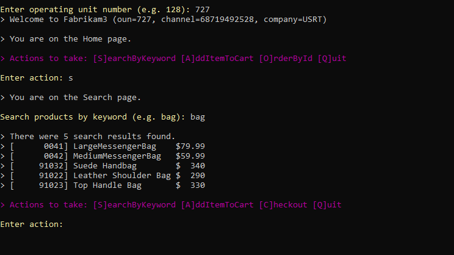
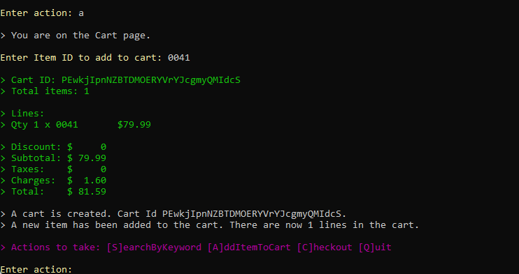
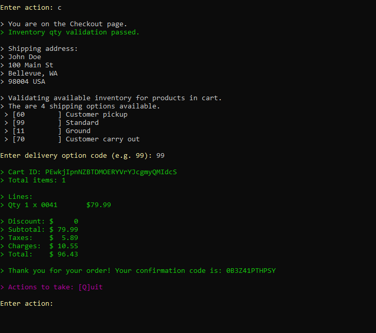
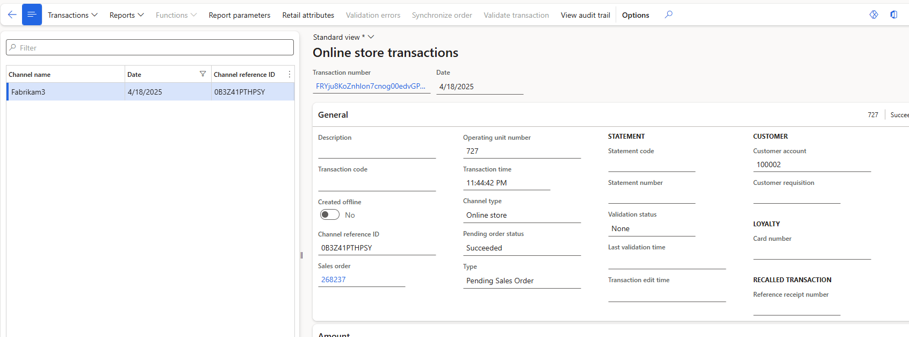

# Overview

This is a sample project showing how to use the headless commerce engine for online scenarios.

# What is covered?

The example walks through a very simple search and purchase flow.

## Prerequisites

Before you can run the sample, the following criteria must be met:

1. You must have a working Commerce scale unit with data synchronized from CDX.
2. The data must be configured for e-commerce scenarios. If in doubt, use demo data.
3. Make the project as startup project

To begin, please put in the endpoint to the Commerce APIs in Program.cs.
After you compile the project, please run HeadlessCommerceEngineSample.exe from a command prompt.

## Suggested demo script

To start, try the following scenario (assuming demo data is configured):

1. Select 128 (Fabrikam extended online store)
2. Type S to search for products.
3. Search for bag
4. Type A to select an item to add to cart.
5. Type the item number: 92002
6. Type C to start checkout
7. Type 99 for standard shipping. (Note: customer pickup will not work since line-level delivery has not been implemented in this example)
8. Take a note of your order number.

To see the sales order created in HQ:

1. Go to Retail and Commerce > Retail and Commerce IT > Distribution schedule.
2. Run P-0001 job to pull the sales transaction from channels to HQ.
3. Go to Retail and Commerce > Retail and Commerce IT > Synchronize orders job.
4. Go to Retail and Commerce > Inquiries and reports > Online store transactions

