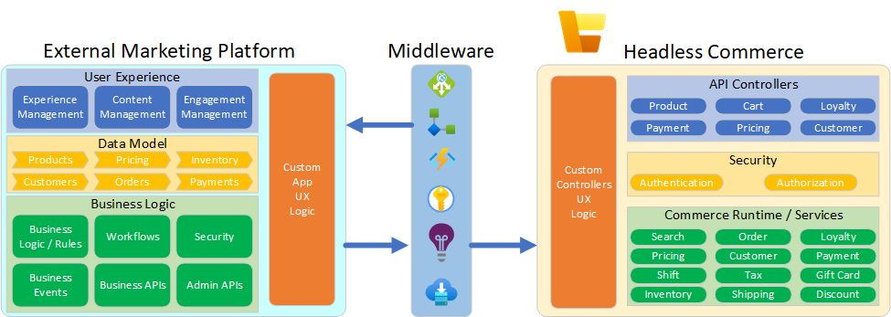

# Dynamics 365 Headless Commerce Integration

## Overview

This documentation is intended to help customers and partners kickstart and accelerate Dynamics 365 Commerce Headless Commerce integrations.

### What is "Headless" Commerce?

Headless commerce is an e-commerce setup where the user interface (front-end) is separated from the back-end commerce operations. This allows for adaptable content distribution across multiple platforms such as websites, mobile apps, kiosks, and IoT devices. It empowers brands to craft distinctive storefront experiences and enables developers to utilize modular tech stacks with their preferred top-tier commerce tools.

Integrating with Dynamics 365 Commerce for a headless commerce setup leverages the strengths of both platforms to create a unified backend while providing a flexible frontend experience. This integration allows Dynamics 365 to manage operational aspects like inventory, pricing, and order management, while the third-party platform powers the user experience (UI).

APIs synchronize data between third-party commerce platforms and Dynamics 365 Commerce, facilitating data transformation.

The Dynamics 365 Commerce Scale Unit (CSU) acts as the middle layer, connecting any app or endpoint to the backend.

More information in the [Architecture](./Docs/Architecture/architecture.md) documentation.

## Benefits of Headless Commerce Integration

1. Dynamics 365 Commerce easily integrates with other Microsoft solutions like Dynamics 365 Sales, Customer Service, and Supply Chain Management, creating a unified ecosystem. This integration provides centralized data and streamlined workflows across sales, inventory, and customer service, enhancing operational efficiency and reducing the need for multiple platforms.
2. Dynamics 365 handles complex backend processes, like inventory, fulfillment, and order management, while third-party platforms focus on user experience.
3. Dynamics 365 Commerce supports both B2B and B2C sales models, which makes it ideal for companies with complex or hybrid sales channels. With a headless setup, you can create unique storefronts or portals for B2B clients while using the same backend for B2C customers, all managed in one central platform.
4. With a headless commerce setup, expanding into new markets becomes more manageable, as different frontends can cater to specific locales, languages, and currencies, all connected to a single backend. This setup simplifies operations while providing localized shopping experiences.

## Integration components

- Products: Synchronizes product data, including details like SKUs, pricing, and inventory levels between Dynamics 365 and third-party platforms. Any changes made to products in Dynamics 365 should reflect in the third-party platform automatically, usually through scheduled or real-time updates.
- Customers: Customer profiles, order history, and preferences can be shared between platforms. When a new customer registers or updates their information in the third-party platform, it synchronizes the changes back to Dynamics 365 for centralized customer data management.
- Order Management: Orders placed on third-party platforms flow to Dynamics 365 for fulfillment and tracking. This enables consolidated order management across channels.
- Inventory and Pricing: Real-time inventory levels and dynamic pricing updates are critical, especially in multi-channel environments. Dynamics 365 can push these updates to the third-party platform, ensuring that the frontend displays accurate stock and price data.
- Payment and Checkout: The third-party system manages the frontend checkout, but payment and order details are passed to Dynamics 365. This setup provides consistent financial reporting and streamlined backend processing.

## Documentation and mapping

### Components

This repository is composed of documentation folders describing the architecture and the key components of the data model/APIs for the integration.

### Folder structure

| Folder   |                                                                                      | Description                                                                                                                                                                                                                                                                                         |
| -------- | ------------------------------------------------------------------------------------ | --------------------------------------------------------------------------------------------------------------------------------------------------------------------------------------------------------------------------------------------------------------------------------------------------- |
| Docs\    |                                                                                      |
|          | [Architecture](./Docs/Architecture/architecture.md)                                  | A an overview of headless integration patterns and concepts.                                                                                                                                                                                                                                        |
|          | [Customers](./Docs/Customers/customers.overview.md)                                  | Details for integrating Customer master data.                                                                                                                                                                                                                                                       |
|          | [Inventory](./Docs/Inventory/inventory.overview.md)                                  | Query Inventory for your products                                                                                                                                                                                                                                                                   |
|          | [Orders](./Docs/Orders/orders.overview.md)                                           | Process orders through the CSU(Headless commerce engine)                                                                                                                                                                                                                                            |
|          | [Payments](./Docs/Payments/payments.overview.md)                                     | Payment integration                                                                                                                                                                                                                                                                                 |
|          | [Prices](./Docs/Prices/prices.overview.md)                                           | Details for integrating product pricing and discounts.                                                                                                                                                                                                                                              |
|          | [Products](./Docs/Products/products.overview.md)                                     | Details for integrating product master data.                                                                                                                                                                                                                                                        |
| Assets\  |                                                                                      | Code samples and tools                                                                                                                                                                                                                                                                              |
|          | [HeadlessCommerceCommonAPICollection](./Assets/HeadlessCommerceCommonAPICollection/) | This collection provides a set of common headless commerce APIs to help understand and interact with them using Insomnia                                                                                                                                                                            |
|          | [SampleCommerceProductPublisher](./Assets/SampleCommerceProductPublisher/README.md)  | To help kickstart the Product integration, we provide a sample code of a Function App and a publisher component that uses Dynamics 365 Retail Proxy to perform the API calls to the Headless Commerce Engine APIs and retrieve the product information based on changes in the product information. |
|          | [SampleCustomerCreateSearch](./Assets/SampleCustomerCreateSearch/)                   | Logic app samples to create a new customer and to search for a customer using headless APIs.                                                                                                                                                                                                        |
|          | [HeadlessSampleConsoleApp](./Assets/HeadlessSampleConsoleApp/)                       | Sample console app to ingest orders into CSU                                                                                                                                                                                                                                                        |

### Assets Notes

**Insomnia Collection Usage:**

- Import the provided Insomnia collection into your Insomnia workspace.
- Use the predefined requests to interact with the headless commerce APIs.
- You will need to configure your Insomnia environment with your own required keys and secrets.
- Refer to the headless commerce [API documentation](https://learn.microsoft.com/en-us/dynamics365/commerce/dev-itpro/retail-server-customer-consumer-api) for detailed information on each endpoint.

## Contributing

This project welcomes contributions and suggestions. Most contributions require you to agree to a Contributor License Agreement (CLA) declaring that you have the right to, and actually do, grant us the rights to use your contribution. For details, visit https://cla.opensource.microsoft.com.

When you submit a pull request, a CLA bot will automatically determine whether you need to provide a CLA and decorate the PR appropriately (e.g., status check, comment). Simply follow the instructions provided by the bot. You will only need to do this once across all repos using our CLA.

This project has adopted the [Microsoft Open Source Code of Conduct](https://opensource.microsoft.com/codeofconduct/). For more information see the [Code of Conduct FAQ](https://opensource.microsoft.com/codeofconduct/faq/) or contact [opencode@microsoft.com](mailto:opencode@microsoft.com) with any additional questions or comments.
