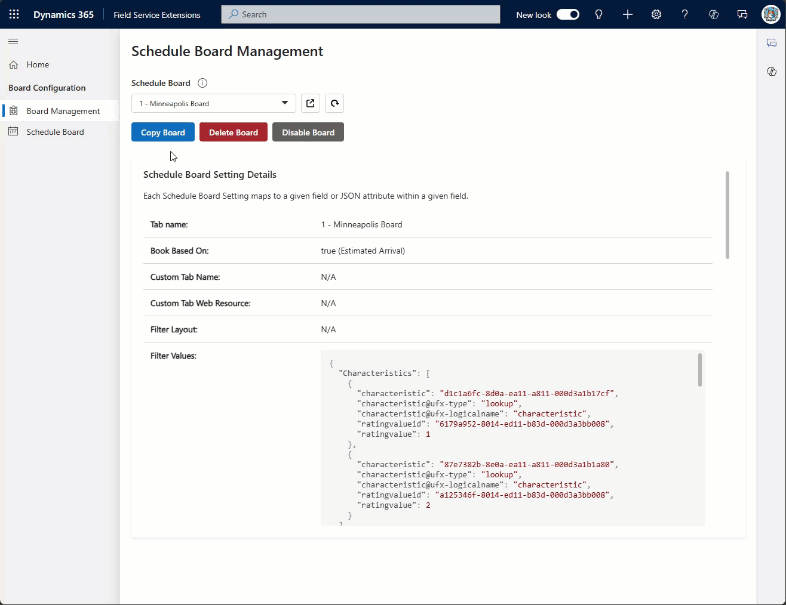
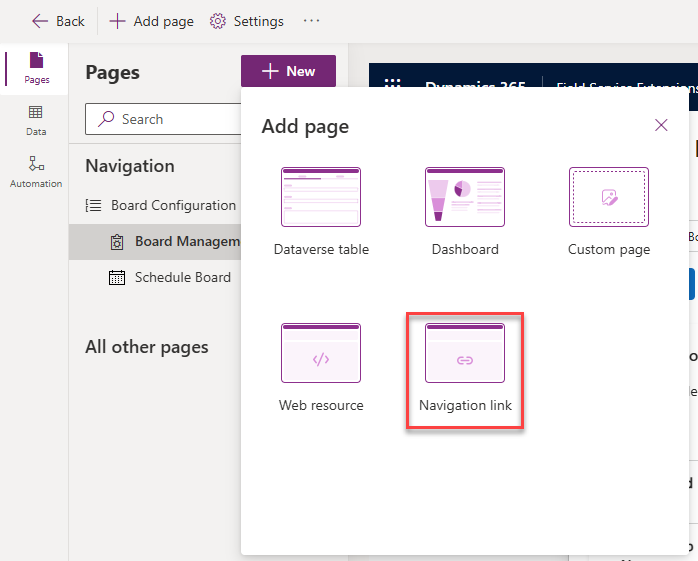
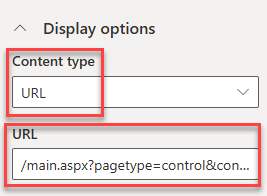

# Schedule Board Settings Management (Virtual)

## Note on Virtual Controls
This control is functionally the same as the ScheduleBoardSettingsManagement control in the Component Library directory. However, it uses the new virtual PCF control framework, and has some refactored code as a result. The net benefit here is that virtual PCF controls have smaller bundle.js sizes, thus promoting faster load times, as they rely on Fluent UI/React libraries already loaded by the platform.

For more information on virtual PCF controls, go here: https://learn.microsoft.com/en-us/power-apps/developer/component-framework/react-controls-platform-libraries

## Overview

The Schedule Board is a crucial tool for Field Service customers, and the configurations and settings for a given Schedule Board tab can be critical in painting the right picture for dispatchers and allowing them to schedule resources effectively and accurately. Often, dispatchers need multiple tabs to effectively schedule their resources, and those tabs may have slight variations in their settings. A commonly requested feature is the ability to perform a Save As/copy on a given board tab, so that small changes can be made to the new board tab and be used quickly.

The Schedule Board Settings Management is a custom Power Apps component framework (PCF) control designed to enhance the management of Schedule Board settings in Dynamics 365 Field Service. This control provides a user-friendly interface for viewing, copying, deleting, and enabling/disabling Schedule Board settings.

## Features

- **View Schedule Board Settings**: Display a dropdown list of all available Schedule Board settings.
- **Copy Settings**: Create a copy of an existing Schedule Board setting with a new name. This provides a quick way to achieve Save As functionality for Schedule Board tabs.
- **Delete Settings**: Remove a selected Schedule Board setting (except for system-protected boards - see the Limitations section).
- **Enable/Disable Settings**: Toggle the active state of a Schedule Board setting. Disabled records will not show as tabs in the Schedule Board.
- **Detailed View**: Show comprehensive details of each Schedule Board setting, including JSON configurations.
- **Open in New Tab**: Ability to open the selected Schedule Board setting in a new browser tab for sharing a board with other users/teams.
- **Refresh**: Reload the list of Schedule Board settings to reflect recent changes.

## Technical Details

- Built using TypeScript and React
- Utilizes the Fluent UI React components for a consistent look and feel
- Integrates with Dynamics 365 Web API for data operations
- Implements error handling and user feedback mechanisms
- Utilizes virtual PCF control frameworks for enhanced performance, load times, and smaller control sizes

## Usage

1. Select a Schedule Board setting from the dropdown.
2. View detailed information about the selected setting.
3. Use the provided buttons to copy, delete, or enable/disable the setting.
4. Open the setting in a new tab for more detailed editing/sharing if needed.
5. Refresh the list to see any changes made outside of the control.

## Installation

#### Note: Unlike the ScheduleBoardSettingsManagement control in the URS directory, there is not a prebuilt solution for installing this control. This virtual PCF control is intended to demonstrate the differences/advantages of using this virtual control framework for developers.

For more developer-oriented individuals, the source code in this repository can be cloned and built usind standard PCF control build processes, and the resultant control can be embedded into the model-drive app of your choice.

1. Build the solution using the Power Apps CLI.
2. Import the solution into your Dynamics 365 environment.
3. Add the control to a model-driven app via the Navigation link page type, with a URL field reference like so: /main.aspx?pagetype=control&controlName=o25fs_MicrosoftOptimize25.ScheduleBoardManagement&forceUCI=1. 

#### Note: This is a full-page control and is not intended to be embedded into a form.

## Limitations

- System-protected Schedule Board settings (e.g., "Default", "Initial public view", "Resource utilization view") cannot be deleted or disabled.
- The control requires appropriate user permissions to perform operations on Schedule Board settings.

## Third-Party Libraries

This project uses the following third-party libraries:

- **highlight.js**: Used for syntax highlighting of JSON content.
  - License: BSD 3-Clause License
  - Website: https://highlightjs.org/
  - License details: https://github.com/highlightjs/highlight.js/blob/main/LICENSE

## Support

This control source code and unmanaged solution are provided as-is. Bugs, feature addition/modification requests, and other changes are the responsibility of the end-user.
You accept any responsibility for issues you may cause in modifying/copying Schedule Board Settings via this component. Always thoroughly test components in a non-prod environment.
