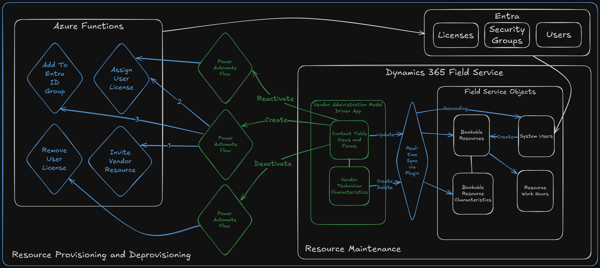
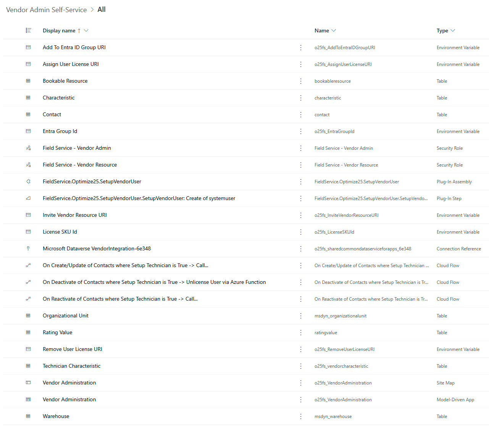
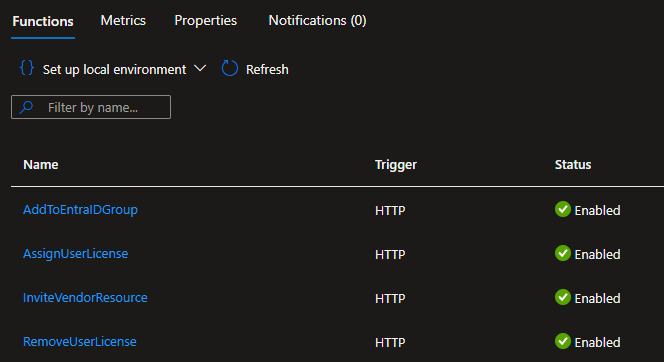
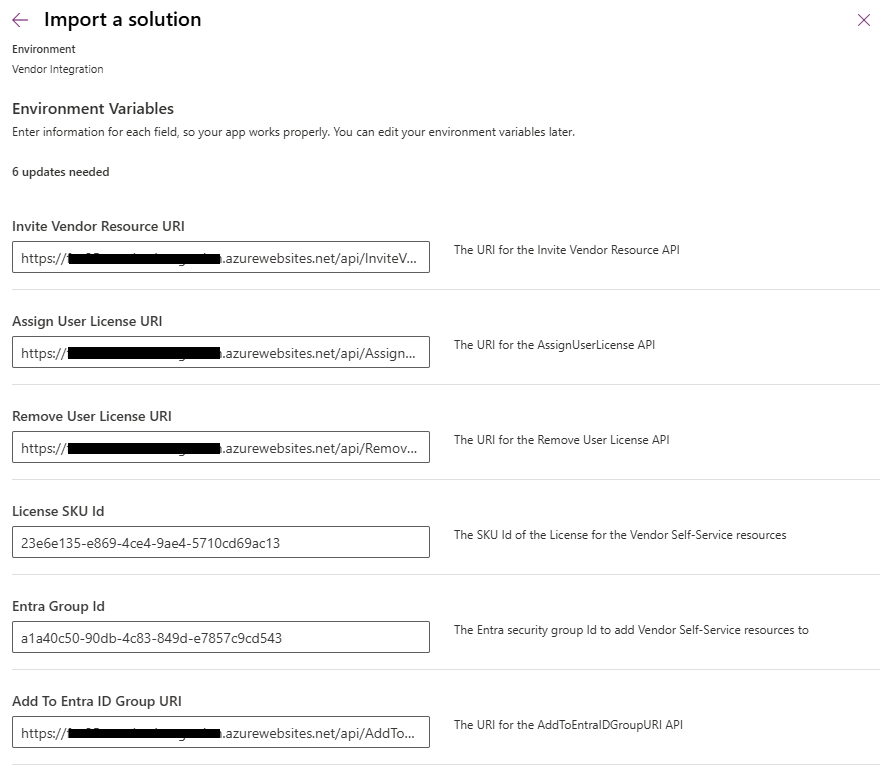
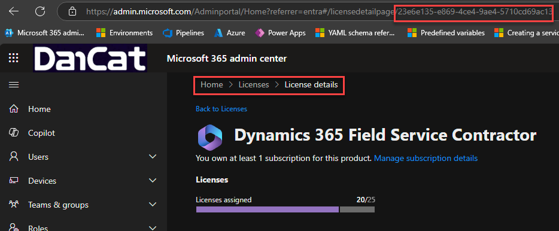

# Vendor Self-Service

## Overview
The Vendor Self-Service solution enables organizations using Dynamics 365 Field Service to efficiently manage external vendors and contractors. This solution automates the process of setting up vendor resources, managing their characteristics, and handling their access to the system. Ultimately these resources can then login to the Field Service mobile app to do field work.

## Architecture

### Components
1. **Dynamics 365 Solution**
   - Custom entities for vendor management in a lightweight model-driven app
   - Plugins for automated resource setup and real-time syncing of Field Service configurations and characteristics
   - Power Automate flows for vendor lifecycle management via Azure Function calls
   
   

2. **Azure Functions**
   - InviteVendorResource
   - AssignUserLicense
   - RemoveUserLicense
   - AddToEntraIDGroup

   

## Setup Steps

### Azure Functions
1. Provison an Azure Function App (or leverage an existing one)
2. Deploy Azure Functions to Function App (Guide: https://learn.microsoft.com/en-us/azure/azure-functions/functions-create-your-first-function-visual-studio#publish-the-project-to-azure)
3. Ensure ClientId, ClientSecret, and TenantId environment variables are populated with a service principal that has rights to send Azure B2B invites, create users, add users to Entra security groups, and apply/remove M365 licenses
4. Ensure Functions are turned on and available to be invoked from Power Automate flows in your tenant

### Dynamics 365 Solution
1. Download the solution ZIP file from the repository
2. Import the solution (unmanaged) into your environment - note the solution dependencies below:

3. Set environment variables on solution import with your 4 Azure Function URIs, the License SKU Id (the GUID of the license to apply to vendor resources, typically Field Service Contractor, GUID can be obtained from the M365 portal or Entra portal) and Entra Security Group Id (the GUID of the security group providing D365 privilages via security roles)
   
   - Azure Function URIs can be obtained from the Azure Portal Functions themselves
   - License SKU Id can be obtained from the M365 admin portal's licensing page, by clicking on the desired license and copying the GUID at the end of the URL
     
   - Entra Security Group Id can be obtained from the Entra or Azure Portals via navigating to the group and copying the displayed Id
4. Publish all customizations

## Usage

### Setting up a new vendor administrator
The actual users of this solution are the vendor administrators themselves. All functionalities are available to system admins in Dynamics 365. However, to setup a new vendor admin, simply give them the included Field Service - Vendor Admin security role, ensure they have access to the Vendor Administration model driven app, and that's it.

### Provisioning new vendor resources
1. Create a Contact record
2. Fill in required vendor information (at least name and email, but address is recommended as well if location-aware scheduling is needed), save record, add desired Vendor Technician Characteristics
3. Set the "Setup Technician" flag to true
4. System automatically:
   - Sends invitation via Azure B2B to the email on the Contact and creates a user in Entra
   - Assigns your designated license
   - Adds user to your designated security group
   - Creates bookable resource upon creation of user record
5. Once the user accepts their invite, they can then login to the Field Service mobile app to do field work

### Syncing changes from vendor resources to backend bookable resources
- Fields on the Contact that have matching fields on the bookable resource sync automatically via plugin. The plugin is synchronous so any errors surfaced on the bookable resource will get presented to the vendor administrator.
- Vendor Technician Characteristics created or deleted on the Contact will sync to the bookable resource characteristics for the bookable resource.
- Should the address change from initial values on the Contact, you must re-geocode the record manually using the Geo Code button in the command bar of the contact.
- Work Hours are surfaced with a form-within-a-form OOB control and operate no differently than adjusting work hours via the bookable resource form.

### Deprovisioning and reprovisioning existing vendor resources
**Note: Do not set the Setup Technician toggle to off**
- To deprovision a resource, simply deactivate the Contact record. This will unassign the license from the respective Entra user and ultimately deactivate the system user.
- Conversely, to reprovision an existing resource, simply reactivate the Contact record. This will reassign the license to the respective Entra user and ultimately reactivate the system user.

## Disclaimer

This solution and code are provided as-is. This is not first-party Microsoft product or code, and should not be treated as such. Always test in a non-production environment. This solution is intended to be adjustable and extendable by end customers.
