# Plan Comparison Report Using Azure Synapse

# Significance of Planning Optimization

The built-in master planning engine is deprecated and is being replaced by the Planning Optimization Add-in for Microsoft Dynamics 365 Supply Chain Management.  
Planning Optimization enables master planning calculations to occur outside of Supply Chain Management and its Azure SQL database. The benefits that are associated with Planning Optimization include improved performance and minimized impact on the SQL database during master planning runs. Given, quick planning runs can be done even during office hours, planners can immediately react to demand or parameter changes. 
For more information about Planning Optimization, see [Master planning system architecture](https://learn.microsoft.com/en-us/dynamics365/supply-chain/master-planning/master-planning-architecture)

# Why do we need a comparison report?
It may be a challenge for customers that are currently using the existing deprecated planning to move to Planning Optimization, and this comparison report together with the indications on this page can help customers feel more comfortable with the move, as well as saving them time by enabling them to focus only on the items where they see differences in Number of orders, Quantity, Number of products and Percentage of change. 

# Overview
This document describes how to use the Plan Comparison report developed using Power BI Desktop application to compare a classic master plan and a planning optimization plan, by getting the data synced to Dataverse from Dynamics 365 via Azure Synapse Link for Dataverse.

# Prerequisites
# •	Azure Synapse Link for Dataverse is configured (Delta Lake)
We suggest using Azure Synapse Link for Dataverse which offers high performance to get the data for the Comparison report and enables quick comparison between two different plans. 
Setup Azure Synapse link for Dataverse with Dynamics 365 instance by following the documentation.
https://learn.microsoft.com/en-us/power-apps/maker/data-platform/azure-synapse-link-select-fno-data
The necessary tables outlined under ‘Setup required tables’ step 1.3. should be added to the Synapse Serverless SQL Pool database.
# •	Dynamics 365 F&SCM 
Use a Dynamics 365 environment preferably UAT environment with data very close to the production environment, with access to planning parameters to generate a master plan and an Optimization plan. 
# •	Power BI Desktop application
Power BI Desktop is a free application you install on your local computer that lets you connect to, transform, and visualize your data. With Power BI Desktop, you can connect to multiple different sources of data, and combine them (often called modeling) into a data model. This data model lets you build visuals, and collections of visuals you can share as reports, with other people inside your organization. 
You can get the most recent version of Power BI Desktop from the [Windows Store](https://aka.ms/pbidesktopstore), or as a single executable containing all supported languages that you [download](https://www.microsoft.com/en-us/download/details.aspx?id=58494) and install on your computer.
# High level scenario
•	In Dynamics 365 F&SCM application, generate a plan using the existing legacy master plan - (Plan A)

•	Switch to planning optimization feature in the same company to generate another plan - (Plan B)

•	These two plans - Plan A and Plan B will be considered for comparison between number of orders, sum of quantities, number of products and the discrepancies are highlighted in the report

•	The data for the above plans is stored in tables in Dynamics 365 F&SCM database and it should be synced to Synapse workspace using Synapse Link for Dataverse

•	Using the tables in the Synapse Serverless SQL Pool database, users should create the required SQL schema and views to get the data for the report

•	Using a Power BI report, users now should connect to the SQL views in Synapse Serverless SQL pool database to derive the data needed to compare the discrepancies between the above considered plans

•	The users should drill into the differences and understand them with the help of the provided report and indications below
# Deployment & Execution steps
# 1.	Setup required tables
Include the required Dynamics 365 tables in Synapse Link for Dataverse by following the steps below.
1.1.	In the power platform maker portal (https://make.powerapps.com/), select your environment, navigate to Azure Synapse link, select the link (example ‘ContosoSynapseLink’ as shown), and then click ‘Manage tables’.
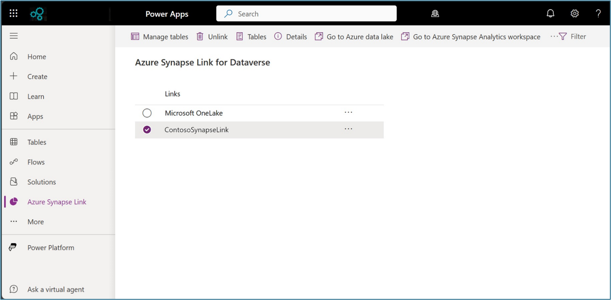

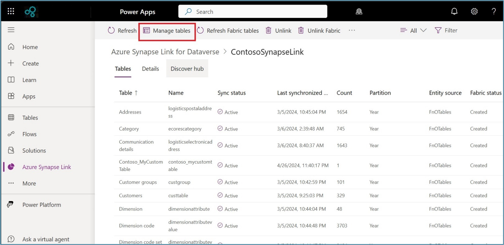
 
1.2.	Click on the ‘D365 Finance & Operations’ pane, select the below tables and click ‘Save’.
•	ReqPO
•	ReqPlanVersion
•	ReqPlan
•	InventDim
•	EcoResProduct
•	EcoResProductTranslation
•	SystemParameters
•	RetailEnumValueTable
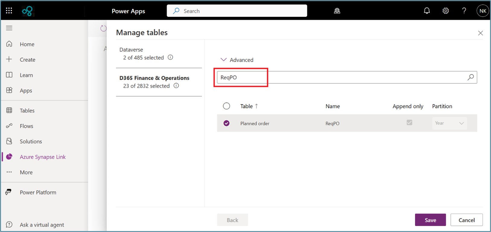
 

1.3.	Once the required tables are selected, then click on ‘Refresh Fabric tables’ and then click on ‘Refresh’ as highlighted. The initial status of the selected tables is ‘Not created’.
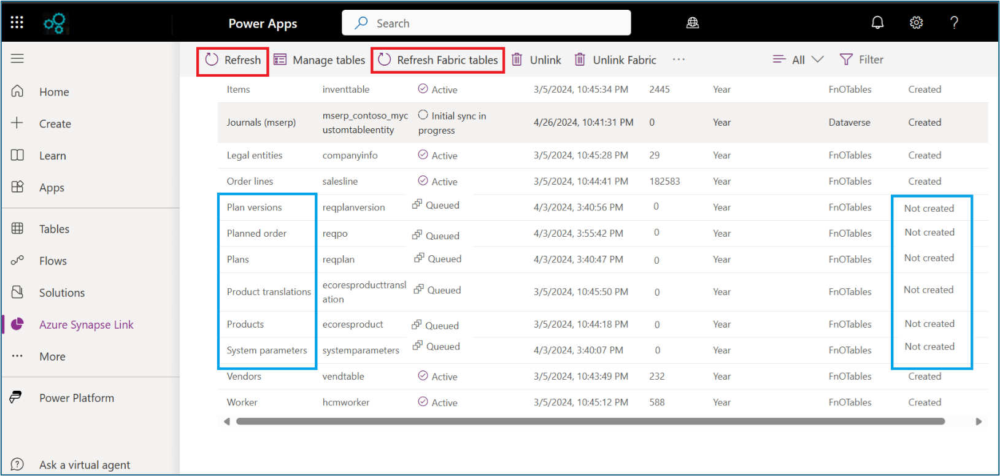
 
It may take some time for the selected tables to sync to the Synapse workspace based on the table size. This can be confirmed by the status of the respective tables showing as ‘Created’ and ‘Active’ as highlighted in the screenshot.
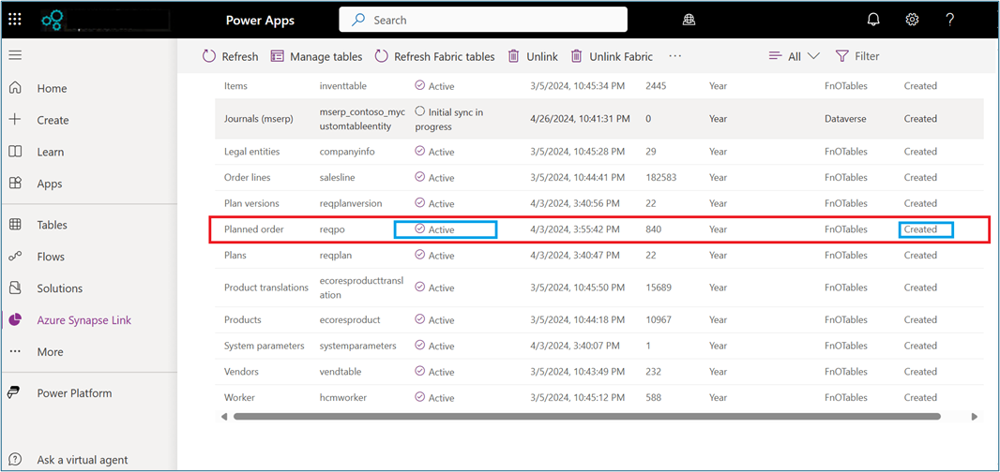
	 
1.4.	Connect to the Synapse Serverless SQL Endpoint using SQL Server Management Studio and create a new schema in the database created by Synapse Link.
To connect to Synapse Serverless SQL endpoint, go through the below link.
https://learn.microsoft.com/en-us/azure/synapse-analytics/sql/connect-overview

1.5.	Open SQL Server Management Studio and login with the credentials if the ‘Connect to Server’ window is shown, else, select ‘Database Engine’ from the ‘Object Explorer’ window.

 
1.6.	Use the authentication ‘Azure Active Directory – Universal with MFA’ and provide ‘Server name’ and ‘User name’.
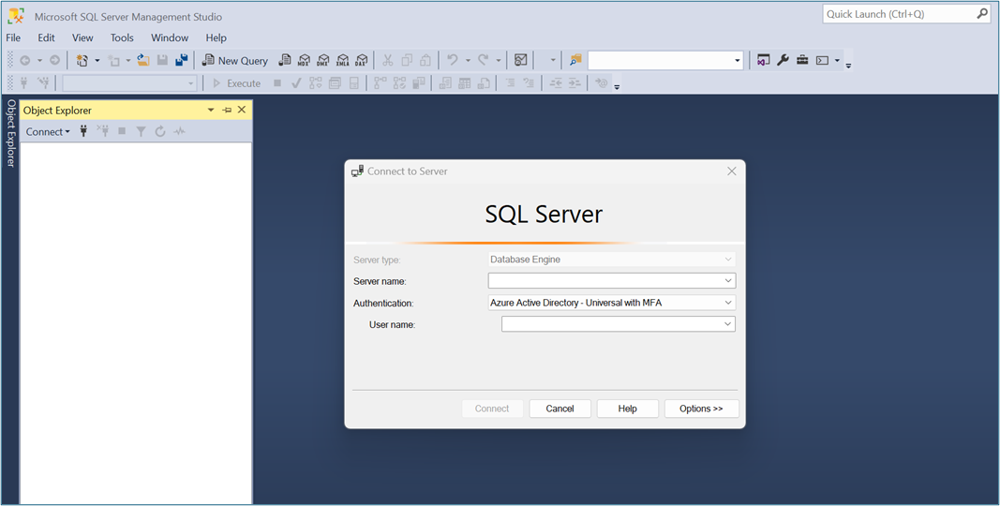 

1.7.	Use the attached script below to create a new Schema ‘ReqPlan’ and the required views ‘EcoResProductSystemLanguage’ and ‘ReqPlannedOrderEntity’ in the database.

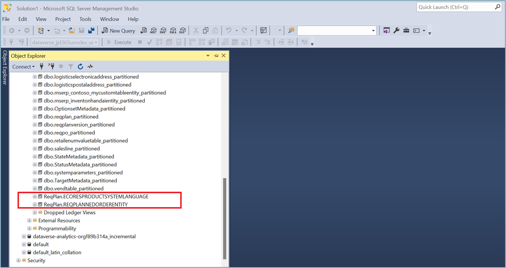  

 
Once the required data objects like tables and views are available in the Synapse Serverless SQL database, you can execute the report to see the differences between the two plans.

# 2.	Execute the report
2.1.	Open the report design ‘PlanComparisonReport_AzureSynapse’ using ‘Power BI Desktop’ application. Click on ‘Transform data’ drop down list and select ‘Edit parameters’ option.
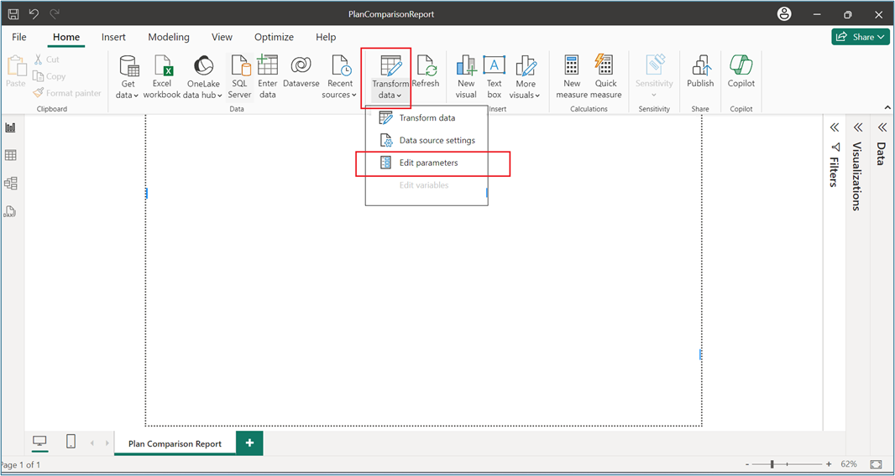
2.2.	Provide the Synapse Serverless SQL Endpoint as Server and database name as parameter values and click ‘Ok’.
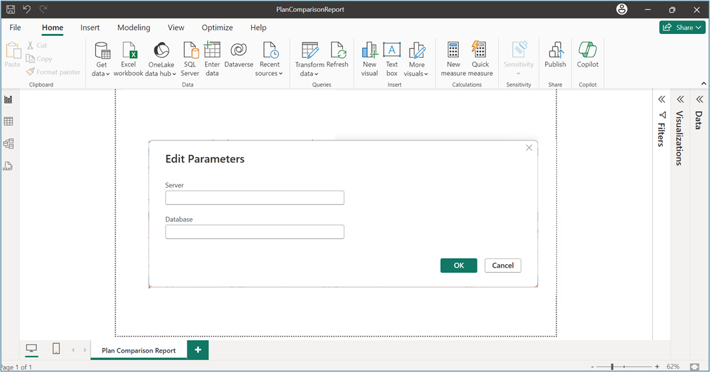 

2.3.	Click on ‘Apply changes’ option to update the datasource for the existing dataset ‘ReqPlan.REQPLANNEDORDERENTITY’ as shown in the ‘Data’ pane on the right side of the report.

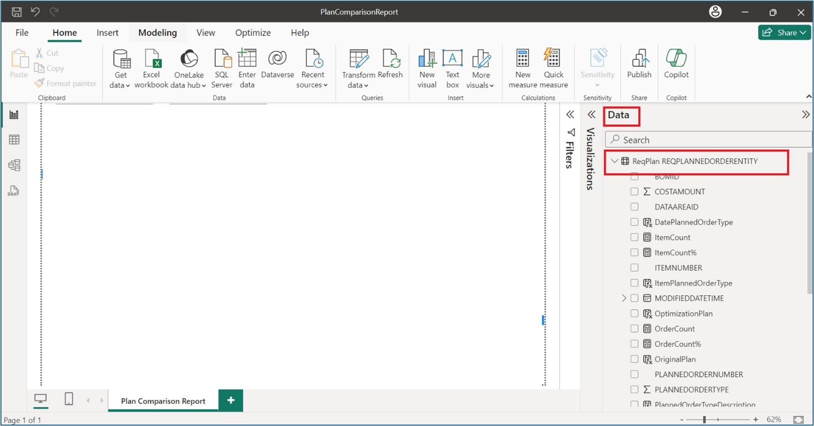
2.4.	On the top left of the report, there are two slicer options to select company and requirement plan. Select the required company and two requirement plans to compare.
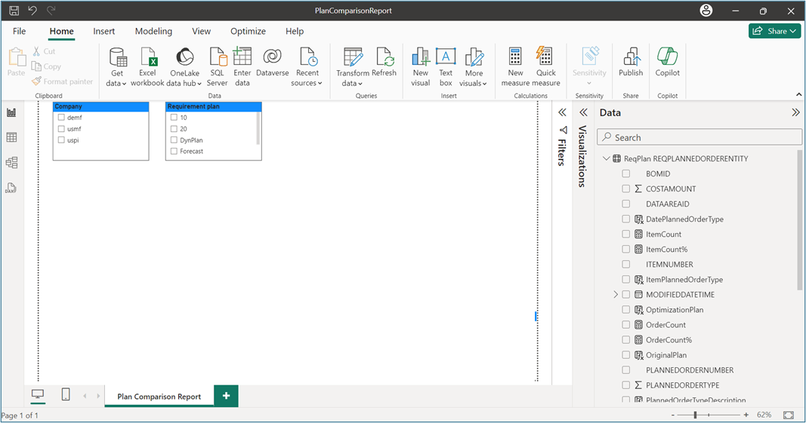 
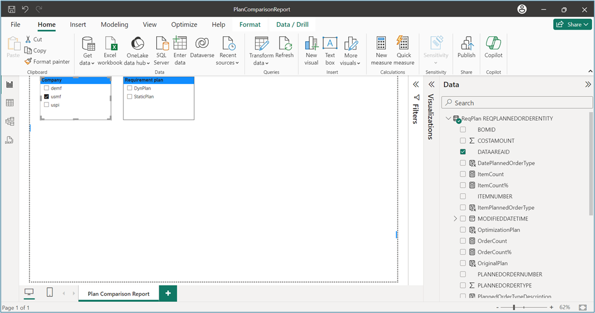
2.5.	On the right side of the report, in the dataset section, select ‘OriginalPlan’ column and provide the plan name which is the master plan. Here for example, we typed in ‘StaticPlan’ for the demo purpose.

 
2.6.	On the right side of the report, in the dataset section, select ‘OptimizationPlan’ column and provide the plan name which is the planning optimization plan. Here for example, we typed in ‘DynPlan’ for the demo purpose.
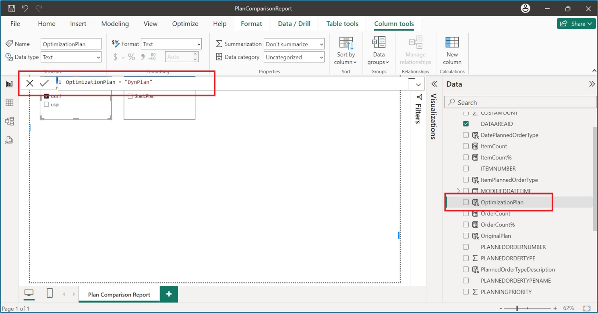
 
The report output is generated with three designs for orders overview, orders by delivery date month and orders by items as shown in the screenshot below.
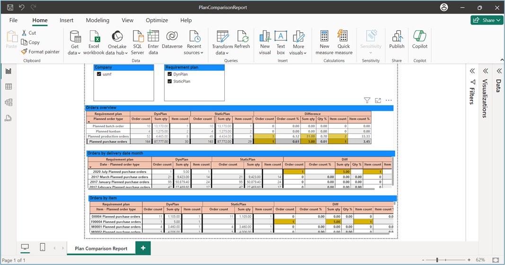
 

# 3.	Design limitations
According to the proposed design, the columns ‘order count %’, ‘Qyt %’ and ‘Item count %’ should be shown only in the ‘Difference’ section. But due the design limitations in matrix layout used in the report, these three columns were shown in the individual plan as well.
# Report UI design workaround
Columns that are not required, are shown in black background colour and the column width for these can be resized (column borders dragged in) to almost negligible width to hide them. The user needs to apply this workaround once the report is generated.
# Before formatting the columns
 
# After formatting the columns

 
# 4.	Usage of the report
# Drill down into the differences between deprecated master planning and planning optimization
On the report output, any differences between the corresponding values of number of orders, quantities and number of items between the two selected plans are highlighted in yellow colour. Users can drill down the required ‘Planned order type’ which shows the discrepancies and isolate the month and item for further inspection.
As shown in the below screenshot, ‘Planned production orders’ were drilled down in ‘Orders overview’ and the corresponding planned production orders for each month and each item are displayed dynamically in the respective report controls ‘Order by delivery data month’ and ‘Order by item’.
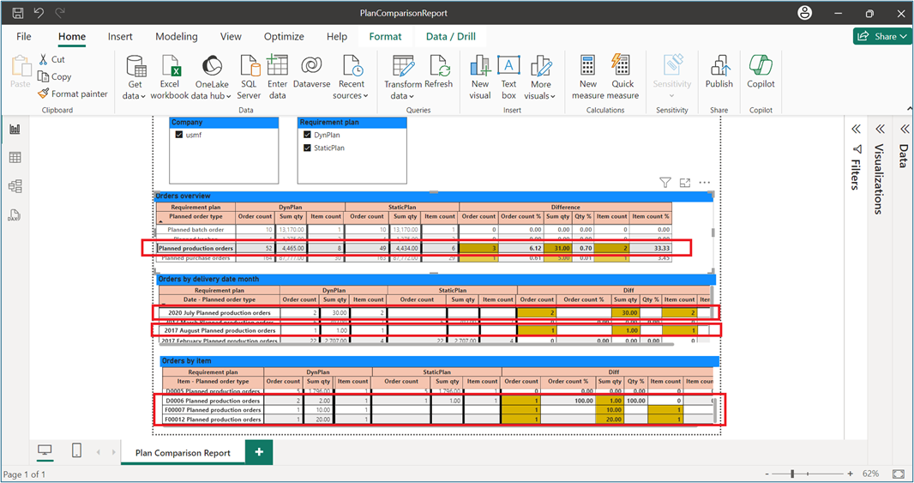
 
The attributes for the discrepancies between master planning and planning optimization are explained in the following links.
[Differences between Planning Optimization and the deprecated master planning engine](https://learn.microsoft.com/en-us/dynamics365/supply-chain/master-planning/planning-optimization/planning-optimization-differences-with-built-in)

[Parameters not used by Planning Optimization](https://learn.microsoft.com/en-us/dynamics365/supply-chain/master-planning/planning-optimization/not-used-parameters)
